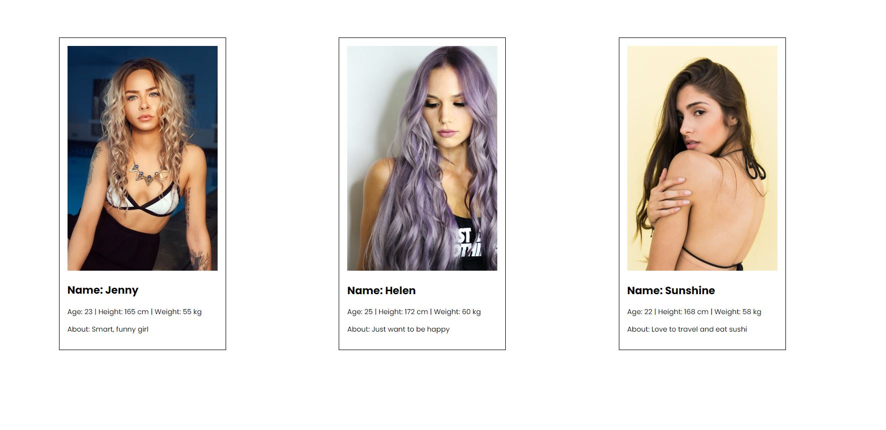

# How to use props in React




## 🦉 Main information

Simple exercise to learn how to use props in React.

Props are inputs to a React component. They are data passed down from a parent component to a child component.

Let's learn how they work using the example of a simple dating app.

First, we need to create a new React project with an empty App.js file.

```
function App() {
  return (
    <div>
    
    </div>
  );
}

export default App;

```

Next step we need to create a new document in the src folder and let's called it Profile.js. We will create a profile card where we will have a profile photo and some information like a name, an age, height, weight and About section. For this we need one `img` tag for photo, `h2` for name and a few `p` for other information.

```
function Profiles() {
    return (
        <div>
            
            <h2>Name:</h2>
            <p>Age:  | Height:  | Weight: </p>
            <p>About: </p>
        </div>
    )
}

export default Profiles;
```

I specifically leave empty spaces after the colon since we will transfer this information from the parent App.js to the child Profile.js.

We will now import this component into the App.js components.

```
import Profiles from "./Profiles";

function App() {
  return (
    <div>
      <Profiles/>
    </div>
  );
}

```
Let's add the necessary props to our component. We will have 3 cards with the different girls profiles.

```
function App() {
  return (
    <div">
      <Profiles
        img=""
        name=""
        age=""
        height=""
        weight=""
        description=""
      />
      <Profiles
        img=""
        name=""
        age=""
        height=""
        weight=""
        description=""
      />
      <Profiles
        img=""
        name=""
        age=""
        height=""
        weight=""
        description=""
      />
    </div>
  );
}

export default App;
```
For profile images you can upload photos to source folder and then import them to App.js or you can find some nice images on free online site like a [unsplash.com](https://unsplash.com/) site.

Now add other required information for the profile cards.

And if you want this information to pass to the Profiles component, you need to add the word `props` in parentheses of App function.

```
function App(props) {
  return (
    <div>
      <Profiles
        img="https://images.unsplash.com/photo-1469460340997-2f854421e72f?w=500&auto=format&fit=crop&q=60&ixlib=rb-4.0.3&ixid=M3wxMjA3fDB8MHxwaG90by1yZWxhdGVkfDV8fHxlbnwwfHx8fHw%3D"
        name="Jenny"
        age="23"
        height="165 cm"
        weight="55 kg"
        description="Smart, funny girl"
      />
      <Profiles
        img="https://images.unsplash.com/photo-1492106087820-71f1a00d2b11?q=80&w=1887&auto=format&fit=crop&ixlib=rb-4.0.3&ixid=M3wxMjA3fDB8MHxwaG90by1wYWdlfHx8fGVufDB8fHx8fA%3D%3D"
        name="Helen"
        age="25"
        height="172 cm"
        weight="60 kg"
        description="Just want to be happy"
      />
      <Profiles
        img="https://images.unsplash.com/photo-1524502397800-2eeaad7c3fe5?q=80&w=1887&auto=format&fit=crop&ixlib=rb-4.0.3&ixid=M3wxMjA3fDB8MHxwaG90by1wYWdlfHx8fGVufDB8fHx8fA%3D%3D"
        name="Sunshine"
        age="22"
        height="168 cm"
        weight="58 kg"
        description="Love to travel and eat sushi"
      />
    </div>
  );
}

export default App;
```
Let's pass these props to the Profiles components. For this we need to add the word `props` in parentheses of Profiles function and add them to our tags inside curly brackets.

```
function Profiles(props) {
    return (
        <div className="item">
            
            <h2>Name: {props.name}</h2>
            <p>Age: {props.age} | Height: {props.height} | Weight: {props.weight}</p>
            <p>About: {props.description}</p>
        </div>
    )
}

export default Profiles;
``` 
That's all! Now add a simple css just to make our profile cards a little more nice looking.

## 🦊 Useful links

### Components and Props

```
https://legacy.reactjs.org/docs/components-and-props.html
```


## ⚡ Built With

You can learn more in the [Create React App documentation](https://facebook.github.io/create-react-app/docs/getting-started).

To learn React, check out the [React documentation](https://reactjs.org/).

